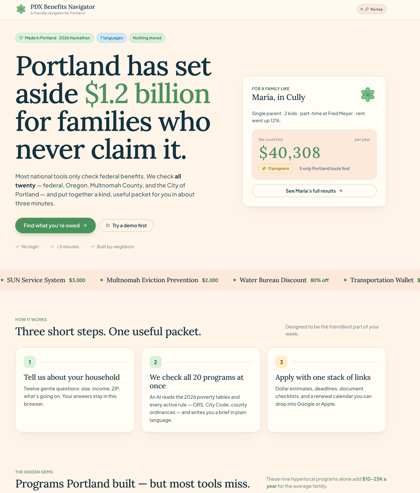
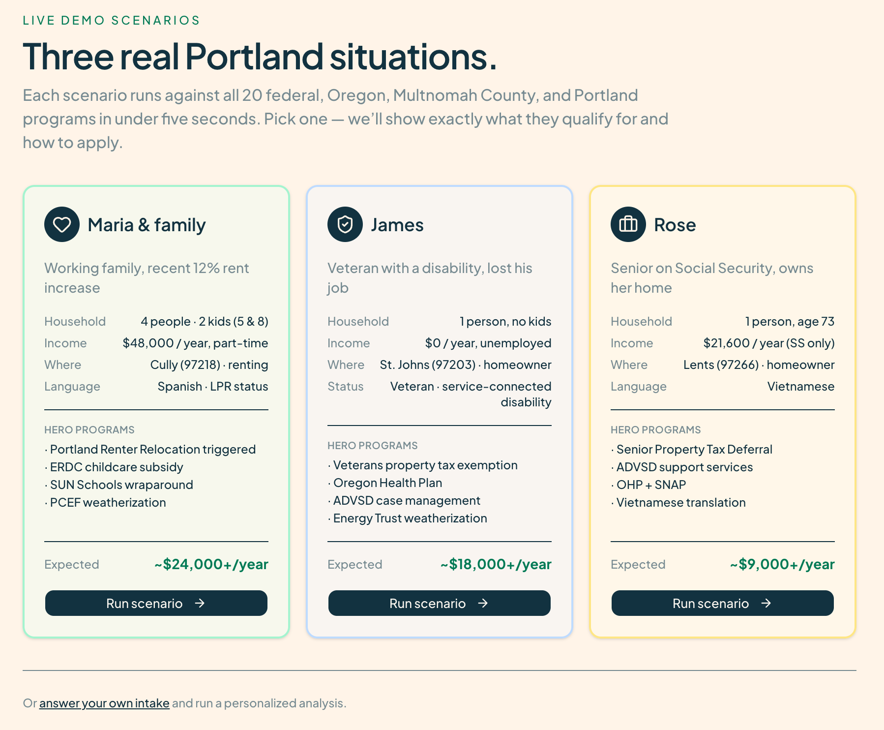
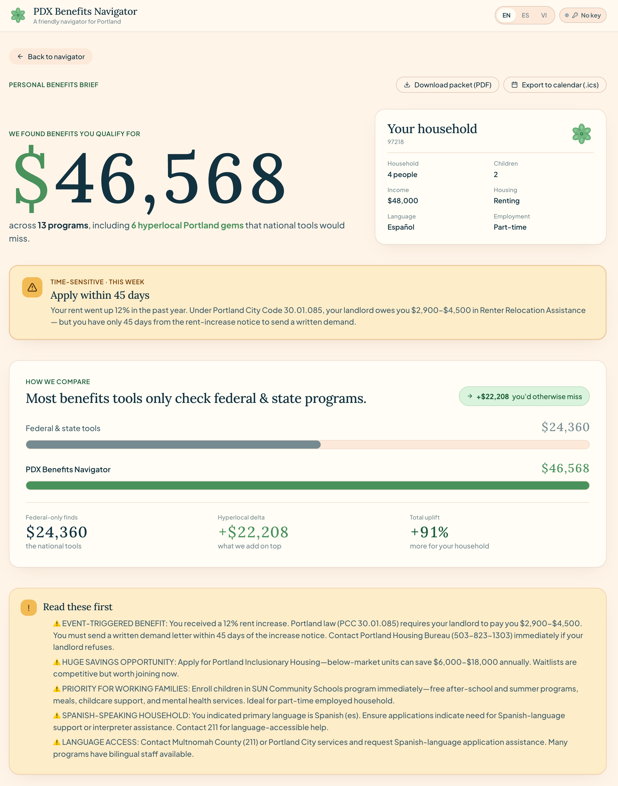
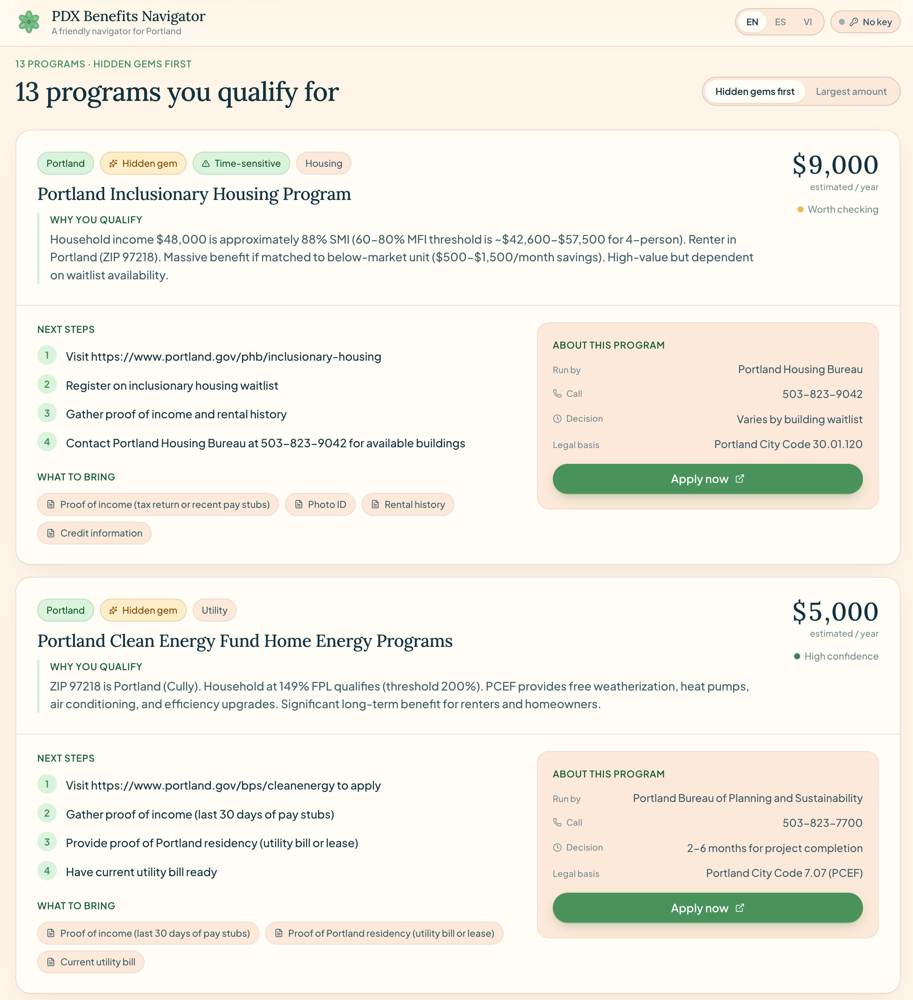

# 🌹 PDX Benefits Navigator

> An AI navigator that helps Portland residents discover every federal, Oregon, Multnomah County, and City of Portland benefit program they qualify for — in about three minutes, with a downloadable application packet.

<p align="center">
  <a href="https://pdx-benefits-navigator.vercel.app/"><strong>🚀 Try the live demo</strong></a>
  &nbsp;·&nbsp;
  <a href="https://pdx-benefits-navigator-hackathon.vercel.app/"><strong>🏁 Hackathon v1.0 snapshot</strong></a>
</p>

<p align="center">
  
  
  
  
  
  
</p>

<p align="center">
  <em>Built for the 2026 AI Portland Build Challenge.</em>
</p>

---

## 📸 A quick look

<table>
  <tr>
    <td width="50%" align="center" valign="top">
      
      <br/>
      <sub><b>Landing</b> — the $1.2B opening hook, a live preview showing what's possible for María's family, and a three-step explainer of how the navigator works.</sub>
    </td>
    <td width="50%" align="center" valign="top">
      
      <br/>
      <sub><b>Demo hub</b> — three pre-baked personas with their hero programs and expected annual benefits, all explorable without an API key.</sub>
    </td>
  </tr>
  <tr>
    <td width="50%" align="center" valign="top">
      
      <br/>
      <sub><b>Results overview</b> — total annual benefits found, side-by-side comparison vs. federal-only tools, time-sensitive urgency banners, priority briefs, and one-click PDF/calendar export.</sub>
    </td>
    <td width="50%" align="center" valign="top">
      
      <br/>
      <sub><b>Results detail</b> — per-program cards with confidence labels, plain-language eligibility reasoning, numbered application steps, document checklist, and the relevant city/state code citation.</sub>
    </td>
  </tr>
</table>

---

## 💸 The problem

Oregon families leave roughly **$1.2 billion** in unclaimed benefits on the table every year.

Most national benefit-screening tools only check **federal** programs (SNAP, Medicaid, WIC). They miss the layer of **state, county, and city** programs where Portland actually invests — programs like Renter Relocation Assistance, the Portland Clean Energy Fund, the SUN Service System, and the Water Bureau Discount.

For a typical Portland family, that gap is **$10,000–$25,000 per year**.

> A federal-and-state screener gets María's family to **$24,360/yr**.
> PDX Benefits Navigator adds the local layer — Multnomah County + City of Portland — and brings the total to **$46,568/yr**. That's **$22,208 more** her family is owed but most tools never surface.

---

## ✨ What it does

- 🤖 **Evaluates all 20 programs at once** — federal + state + county + city, in a single Claude call
- 🌍 **Speaks 3 languages** — English, Spanish, and Vietnamese, with AI-generated translation of the full results page
- 📋 **Conversational intake** — 12 gentle questions, mobile-first, takes ~3 minutes
- 💰 **Per-program dollar estimates** — grounded in official program ranges, with plain-language reasoning
- 📄 **Printable application packet** — server-rendered PDF you can take to a 211 office or a caseworker
- 📅 **Renewal calendar** — `.ics` export so you never miss a re-enrollment deadline
- 🔑 **Bring your own Anthropic key** — the app server never sees your data or your bill

---

## 🚀 Try it in 30 seconds

**No install required.** The three demo personas are pre-baked and load instantly — no API key needed:

- 👉 **[Open the app](https://pdx-benefits-navigator.vercel.app/)** (latest) · **[Hackathon snapshot](https://pdx-benefits-navigator-hackathon.vercel.app/)** (frozen at v1.0)
- 👉 [María — single parent, 2 kids, 12% rent increase](https://pdx-benefits-navigator.vercel.app/demo/maria)
- 👉 [James — disabled veteran, unemployed homeowner](https://pdx-benefits-navigator.vercel.app/demo/james)
- 👉 [Rose — senior on Social Security, Vietnamese-speaking](https://pdx-benefits-navigator.vercel.app/demo/rose)

To run the full intake with your own answers, click the **key icon** in the top right and paste an [Anthropic API key](https://console.anthropic.com/settings/keys). Your key is stored only in your browser.

---

## 👨‍👩‍👧 The three demo families

| Family | Situation | Federal & state programs | PDX Benefits Navigator (full local layer) |
|---|---|---|---|
| **María & family** | Single parent, 2 kids, part-time at Fred Meyer, renter in Cully, Spanish-speaking, 12% rent increase | $14,860/yr | **$36,560/yr** across 11 programs |
| **James** | Single, disabled veteran, unemployed, owns home in St. Johns | $9,807/yr | **$17,707/yr** across 11 programs |
| **Rose** | Senior widow, Social Security only, owns home in Lents, Vietnamese-speaking | $4,600/yr | **$12,500/yr** across 6 programs |

The gap comes from **hidden-gem** programs — 8 of our 20 are flagged this way, and no national tool surfaces them. Numbers are pulled directly from the [`data/scenarios/*.json`](data/scenarios/) fixtures; the source of truth for ranges is [`data/programs.seed.json`](data/programs.seed.json).

---

## 🔐 The BYOK trust model

```
   ┌───────────────┐                       ┌──────────────┐
   │  Your browser │  ──── direct ─────▶  │ Anthropic API │
   │  (your key)   │                       └──────────────┘
   └───────────────┘
        ▲  │
        │  │ stored in localStorage only
        │  ▼
   ┌───────────────┐
   │ This app's    │  ⛔ never sees your key
   │ server        │  ⛔ never sees your intake
   └───────────────┘
```

Personalized analyses run **client-side** with a key you provide. The browser-side Claude client uses `dangerouslyAllowBrowser: true` — which is safe here because the key belongs to the end user, not the app operator.

- ✅ Your API key never leaves your browser (`localStorage`)
- ✅ Your intake answers never leave your browser (`sessionStorage`)
- ✅ No database, no logging of your responses
- ✅ The only server route is `/api/packet`, which renders the PDF from data you POST back — it isn't stored

---

## 🏗️ How it works

```
┌─────────────────────────────────────────────────────────────────┐
│  Browser                                                        │
│                                                                 │
│  /            ── landing                                        │
│  /intake      ── 5-step wizard ──┐                              │
│  /demo/[id]   ── load pre-baked fixture from data/scenarios/    │
│                            │                                    │
│                            ▼ sessionStorage                     │
│  /results     ── streams analysis (via user's key) OR           │
│                  loads pre-baked fixture                        │
│                            │                       │            │
│                            ▼                       │            │
│                   Anthropic API                    │            │
│                   (streamed directly               │            │
│                    from browser)                   │            │
│                                                    │            │
└────────────────────────────────────────────────────┼────────────┘
                                                     │
                                                     ▼
                                            ┌──────────────┐
                                            │ /api/packet  │
                                            │ (PDF render, │
                                            │  no AI)      │
                                            └──────────────┘
```

### Eligibility engine

[`lib/claudeBrowser.ts`](lib/claudeBrowser.ts) wraps the official Anthropic SDK and streams a structured analysis. The system prompt (in [`lib/eligibility.ts`](lib/eligibility.ts)) encodes:

- 2026 Federal Poverty Level tables
- Portland ZIP-code map (so Claude knows `97203` = St. Johns, not Gresham)
- All 20 program rules — income limits, jurisdiction requirements, event triggers
- Confidence-level guidance (`high` / `medium` / `low`)

Prompt caching (`cache_control: { type: 'ephemeral' }`) is applied to the system prompt, so subsequent requests on the same key are cheap.

### No vector DB. No workflow engine.

The full programs database is stuffed into the system prompt. Claude has the entire eligibility picture in context for every request — which means we iterate on rules by editing JSON, not retraining pipelines.

### Pre-baked demo fixtures

[`data/scenarios/maria.json`](data/scenarios/maria.json), `james.json`, and `rose.json` contain pre-computed `AnalysisOutput` payloads. The `/demo/[scenario]` route loads the matching fixture into `sessionStorage`, then redirects to `/results`, which skips the API call when it sees the fixture key. **Demos work for everyone, with no key required and no API spend.**

---

## 🛠️ Tech stack

- **[Next.js 16](https://nextjs.org/)** App Router on **[Vercel](https://vercel.com/)**
- **[React 19](https://react.dev/)** + **TypeScript**
- **[Anthropic Claude](https://www.anthropic.com/api)** — `claude-sonnet-4-6` for eligibility analysis (configurable in [`lib/eligibility.ts`](lib/eligibility.ts))
- **[Tailwind CSS v4](https://tailwindcss.com/)** + custom **Rose City** design tokens (OKLCH palette, Lora + Plus Jakarta Sans pairing)
- **[shadcn/ui](https://ui.shadcn.com/)** + **[Base UI](https://base-ui.com/)** primitives
- **[react-hook-form](https://react-hook-form.com/)** + **[Zod](https://zod.dev/)** for the intake wizard
- **[framer-motion](https://www.framer.com/motion/)** for the money counter + bar animations
- **[@react-pdf/renderer](https://react-pdf.org/)** for the printable application packet
- **[Firecrawl](https://www.firecrawl.dev/)** for the optional program-data scrape pipeline

---

## 📋 The 20 programs

| Jurisdiction | Programs |
|---|---|
| **Federal** | SNAP · OHP/Medicaid · WIC · School Meals · ACP Internet |
| **Oregon** | ERDC childcare · Oregon EITC + Kids' Credit · PGE Income Discount · NW Natural GAP · LIHEAP + Energy Trust · Senior/Disabled Property Tax Deferral · Veterans Property Tax Exemption |
| **Multnomah County** | Eviction Prevention Funds · SUN Service System · ADVSD case management |
| **City of Portland** | 💎 Renter Relocation Assistance · 💎 Water Bureau Discount · 💎 PCEF Home Energy · 💎 Transportation Wallet · 💎 Inclusionary Housing |

💎 = **hidden gem** — 8 of the 20 programs are flagged this way. They're the ones no national tool surfaces, and they drive most of the dollar gap.

---

## 💻 Local development

```bash
git clone https://github.com/NathanPickard/pdx-benefits-navigator.git
cd pdx-benefits-navigator
npm install
npm run dev
```

Then open [http://localhost:3000](http://localhost:3000). Click the **key icon** in the top right to paste your Anthropic API key, or jump straight to a `/demo/*` route (no key required).

### Environment variables

| Variable | Required? | Used by |
|---|---|---|
| `FIRECRAWL_API_KEY` | Only for re-scraping program data | [`scripts/scrape-programs.ts`](scripts/scrape-programs.ts) |

No server-side `ANTHROPIC_API_KEY` is needed for normal operation. The personalized analysis path uses a key the user provides in their browser.

<details>
<summary><strong>Advanced: re-baking the demo fixtures</strong></summary>

If you change the system prompt or the program data, you'll want to regenerate `data/scenarios/*.json`. The precompute script ([`scripts/precompute-scenarios.ts`](scripts/precompute-scenarios.ts)) was written against an earlier server-side route; to use it, either:

1. Restore `app/api/analyze/route.ts` from git history and run `npx tsx scripts/precompute-scenarios.ts`, **or**
2. Update the script to call `analyzeEligibility()` from [`lib/claudeBrowser.ts`](lib/claudeBrowser.ts) directly (with `ANTHROPIC_API_KEY` from env, in a Node context).

The seed file [`data/programs.seed.json`](data/programs.seed.json) is the source of truth for program rules — `data/programs.json` is the live build artifact.
</details>

---

## 🚢 Deploy your own

The app is built for Vercel with zero configuration. Because AI calls happen client-side with user-provided keys, you can deploy publicly without any AI-related env vars — your account never pays for visitor analyses.

[](https://vercel.com/new/clone?repository-url=https%3A%2F%2Fgithub.com%2FNathanPickard%2Fpdx-benefits-navigator)

The only server route is `/api/packet` (PDF generation), which has no AI cost. Demo scenarios are served from static JSON bundled with the build.

---

## 📂 Project structure

```
app/
├── page.tsx                  # Landing
├── layout.tsx                # Root layout (fonts + ApiKeyProvider)
├── globals.css               # Rose City design tokens
├── intake/                   # 5-step intake wizard
├── results/                  # Loading + needs-key + dashboard views
├── demo/
│   ├── page.tsx              # Demo hub
│   └── [scenario]/page.tsx   # Loads fixture → sessionStorage → /results
└── api/packet/route.ts       # PDF generation (only server route)

components/
├── brand/                    # Wordmark, RoseStamp, AppBar, ApiKeyControl
├── intake/                   # ConversationalForm
├── landing/                  # StatReveal
├── results/                  # MoneyCounter, BenefitCard, ComparisonChart, etc.
└── ui/                       # shadcn primitives

data/
├── programs.json             # 20 programs (live database)
├── programs.seed.json        # Hand-curated source of truth
└── scenarios/                # Pre-baked demo AnalysisOutput JSON

lib/
├── eligibility.ts            # Shared system prompt + JSON parsing + totals
├── claudeBrowser.ts          # Browser-side Anthropic client (BYOK)
├── userKey.tsx               # localStorage helpers + ApiKeyProvider
├── scenarios.ts              # María / James / Rose intake fixtures
├── i18n.ts                   # Chrome strings + language list
├── packet.tsx                # PDF document
└── calendar.ts               # .ics export
```

---

## ❓ FAQ

<details>
<summary><strong>Is this an official Portland or Multnomah County tool?</strong></summary>

No. This is an independent project built for the AI Portland Build Challenge. It's a discovery aid — always verify eligibility through the official program or a caseworker before applying.
</details>

<details>
<summary><strong>Is it free to use?</strong></summary>

The hosted app is free. Personalized analyses use an Anthropic API key you provide — Claude API calls typically cost a fraction of a cent per analysis. The three demo scenarios are pre-baked and cost nothing.
</details>

<details>
<summary><strong>Is my information private?</strong></summary>

Yes. Your intake answers live in your browser's `sessionStorage` only — they never reach our server, and there's no database. Your Anthropic API key is stored in `localStorage` and used to call Anthropic directly from your browser.
</details>

<details>
<summary><strong>How accurate are the dollar estimates?</strong></summary>

Every estimate comes from the official benefit range published by the administering agency. Actual amounts depend on caseworker review and current funding cycles. Treat the results as a starting point, not a guarantee.
</details>

<details>
<summary><strong>Can I add a program?</strong></summary>

Yes — please! Open a PR against [`data/programs.seed.json`](data/programs.seed.json). The schema is in [`types/program.ts`](types/program.ts). New programs should include a citation to the official program page.
</details>

<details>
<summary><strong>Why "bring your own key"?</strong></summary>

Three reasons: (1) it keeps the project free for me to host, (2) visitor data never touches my server, and (3) it scales — any number of people can use the tool concurrently without rate-limit collisions.
</details>

---

## ⚠️ Limitations

- **Estimates only — not legal advice.** Verify with the program before applying.
- **Programs database is a snapshot.** Federal Poverty Levels update annually; local programs change funding cycles. Refresh `data/programs.seed.json` when rules change.
- **Eligibility logic is in the prompt.** A deliberate hackathon trade-off — makes the engine fast to iterate on, but rules are encoded in natural language rather than a deterministic engine.
- **AI-generated translations.** Spanish and Vietnamese bundles are produced live by Claude. Good, but not professionally certified.

---

## 🤝 Contributing

PRs welcome, especially:

- New programs to add to the database
- Corrections to program rules or income thresholds
- Additional curated (non-AI) language translations
- Accessibility improvements

---

## 🙏 Credits & data sources

- **2026 Federal Poverty Level** tables (HHS)
- **Oregon Revised Statutes** for state-program rules
- **Portland City Code** + **Multnomah County** ordinances for local programs
- **211info**, **Multnomah County DCHS**, and **Oregon Food Bank** for community context

Built in Portland with **[Claude Code](https://claude.com/claude-code)** (Opus 4.7) as a pair-programmer, a lot of coffee, and gratitude for the people who actually run these programs day to day.

---

## 📄 License

[MIT](LICENSE) © 2026 Nathan Pickard
