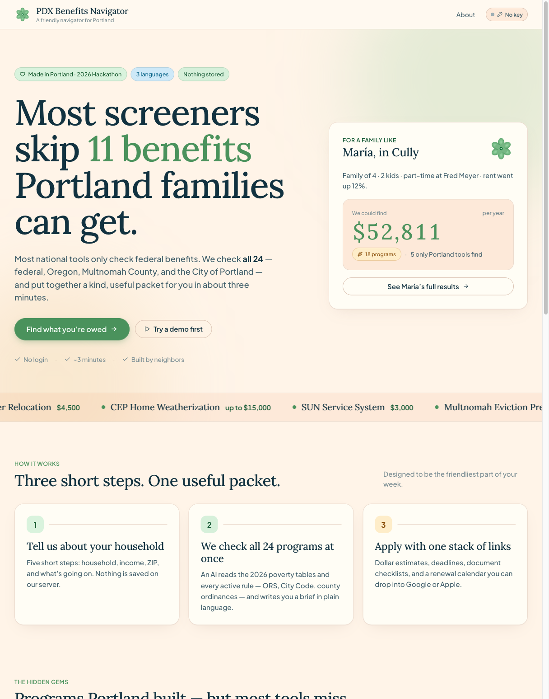
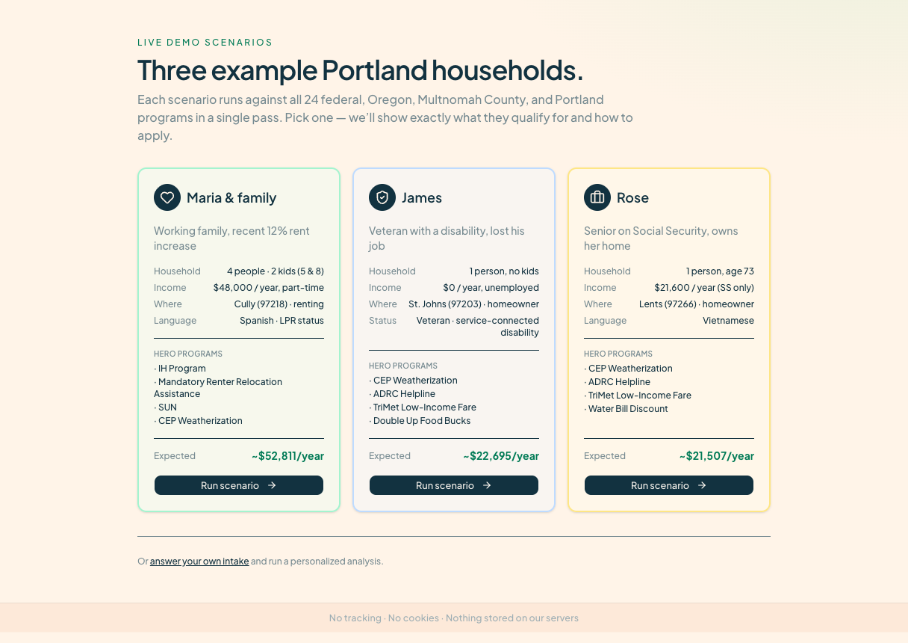
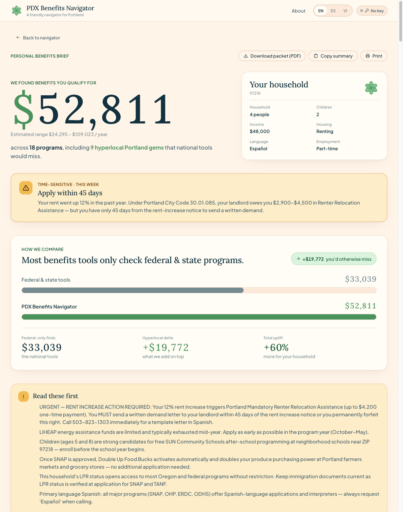
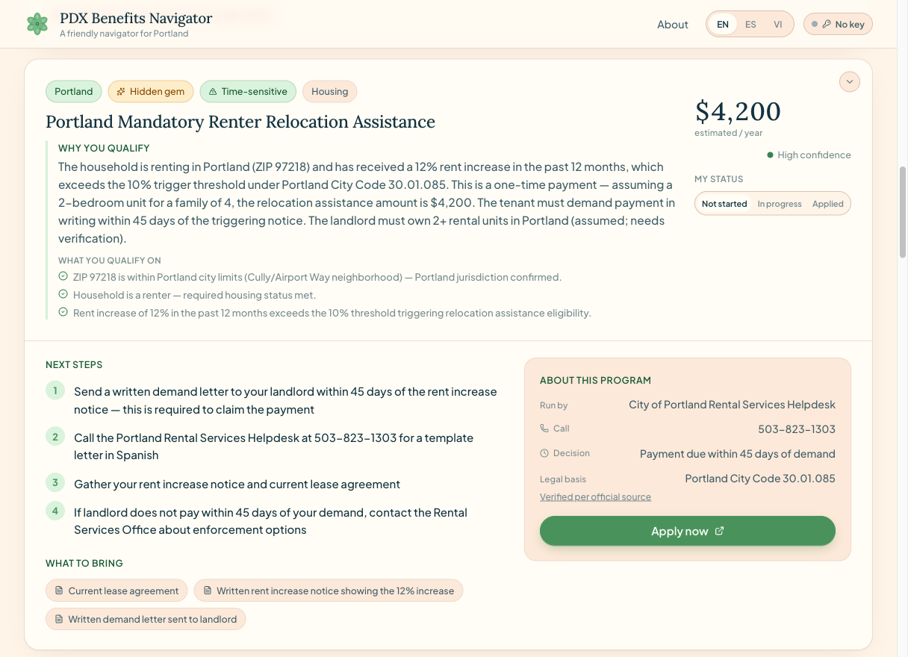

# 🌹 PDX Benefits Navigator

> Screens a Portland household against 24 federal, Oregon, Multnomah County, and City of Portland benefit programs in about three minutes, then produces a printable application packet.

<p align="center">
  <a href="https://pdx-benefits-navigator.vercel.app/"><strong>🚀 Live demo</strong></a>
  &nbsp;·&nbsp;
  <a href="CASE_STUDY.md"><strong>📖 Engineering case study</strong></a>
  &nbsp;·&nbsp;
  <a href="evals/REPORT.md"><strong>📊 Eval scoreboard</strong></a>
  &nbsp;·&nbsp;
  <a href="ARCHITECTURE.md"><strong>🗺️ Architecture</strong></a>
</p>

<p align="center">
  <a href="https://github.com/NathanPickard/pdx-benefits-navigator/actions/workflows/ci.yml"></a>
  
  
  
  
  
  
</p>

<p align="center">
  <em>Built solo for the 2026 AI Portland Build Challenge, then hardened with an eval harness, data-integrity gates, and a domain glossary.</em>
</p>

## For engineering reviewers

Each claim below links to the code or report that backs it, so you can check it in about five minutes:

| Claim | Evidence |
|---|---|
| **The AI is graded, not trusted.** 14 hand-derived ground-truth households, including income cliffs and jurisdiction traps, score the live engine on which programs it finds, whether dollar estimates fall inside official ranges, confidence, and reasoning checked by a second model. | [`evals/REPORT.md`](evals/REPORT.md): F1 0.95 (precision 0.94, recall 0.98) and 96% of dollar estimates inside official ranges. Every failure is listed by name. |
| **The grader gets graded too.** The eval has caught three bugs in its own scoring: a judge that lacked the income tables, two wrong answer-key calls, and a dollar check that marked official SNAP amounts as wrong. | [`CASE_STUDY.md` §3](CASE_STUDY.md#3-grading-the-ai-with-receipts), [`adr/0001`](adr/0001-widened-official-range.md) |
| **Eligibility is derived, not declared.** The model fills in a checklist with one line per program requirement. Code computes eligibility from that checklist and recomputes every dollar total, overriding the model's own verdict. | [`lib/eligibility.ts`](lib/eligibility.ts) `deriveEligibility` and `recomputeTotals`, structured output via Zod in [`lib/claudeBrowser.ts`](lib/claudeBrowser.ts) |
| **Privacy by architecture.** The browser calls Anthropic directly with the visitor's own API key. The app's one API route renders a PDF and stores nothing. There's no database, no analytics, and no logging of answers. | [How your data flows](#how-your-data-flows), [`app/api/packet/route.ts`](app/api/packet/route.ts) |
| **Data integrity is a CI gate.** A Zod schema plus invariant checks guard both the curated program data and the merged runtime copy. CI fails if a scrape ever changes eligibility policy. | [`scripts/validate-data.ts`](scripts/validate-data.ts), [CI workflow](.github/workflows/ci.yml) |
| **Built for AI-assisted development.** An agent starts from hard rules, a codebase map, a domain glossary, and recorded decisions, and the eval scoreboard decides whether a prompt or model change ships. | [How this repo works with AI agents](#how-this-repo-works-with-ai-agents) |

To see it working without a key, open [María's demo](https://pdx-benefits-navigator.vercel.app/demo/maria).

## Screenshots

<table>
  <tr>
    <td width="50%" align="center" valign="top">
      
      <br/>
      <sub><b>Landing</b>: the pitch, a preview of María's results, and a three-step explainer.</sub>
    </td>
    <td width="50%" align="center" valign="top">
      
      <br/>
      <sub><b>Demo hub</b>: three pre-computed households you can open without an API key.</sub>
    </td>
  </tr>
  <tr>
    <td width="50%" align="center" valign="top">
      
      <br/>
      <sub><b>Results overview</b>: María's estimated annual total with its likely range, a time-sensitive deadline, and the comparison with federal-and-state tools.</sub>
    </td>
    <td width="50%" align="center" valign="top">
      
      <br/>
      <sub><b>Program card</b>: plain-language reasoning, the requirement checklist, next steps, documents to bring, and the legal basis.</sub>
    </td>
  </tr>
</table>

## Why the local layer matters

National benefit screeners check federal programs, and some add state programs. They skip the county and city programs where Portland invests its own money, such as Renter Relocation Assistance ($2,900–$4,500 after a rent increase of 10% or more) and the Water Bureau's bill discount. For the three demo households, those local programs add about $8,600 to $19,800 a year.

<!-- README:HOOK:START -->
> Federal and Oregon programs alone come to **$33,039/yr** for María's family.
> Adding Multnomah County and City of Portland programs brings the estimate to **$52,811/yr**: **$19,772 more** that federal-and-state screeners don't check.
<!-- README:HOOK:END -->

## What it does

The app runs one screening per household and turns the result into something a family can act on:

- **Screens all 24 programs in one Claude call**: federal, Oregon, Multnomah County, and City of Portland
- **Conversational intake**: a 5-step, mobile-first form that takes about three minutes
- **Per-program dollar estimates**: anchored to each program's official range, with plain-language reasoning
- **Near misses**: programs the household almost qualifies for, with the requirement that failed
- **Printable application packet**: a server-rendered PDF to bring to a 211 office or a caseworker
- **Renewal calendar**: an `.ics` file of re-enrollment deadlines
- **Spanish and Vietnamese results**: AI translation of the results page, using your API key
- **Bring your own Anthropic key**: analyses run on your key, so the app costs nothing to host

## Try it without installing anything

The three demo households are pre-computed, so they load instantly with no API key:

- **[Open the app](https://pdx-benefits-navigator.vercel.app/)** (latest) or the **[hackathon snapshot](https://pdx-benefits-navigator-hackathon.vercel.app/)** (frozen at v1.0)
- [María](https://pdx-benefits-navigator.vercel.app/demo/maria): household of 4 with 2 kids, renter, 12% rent increase
- [James](https://pdx-benefits-navigator.vercel.app/demo/james): disabled veteran, unemployed homeowner
- [Rose](https://pdx-benefits-navigator.vercel.app/demo/rose): senior on Social Security, Vietnamese-speaking

To screen your own household, click the **key icon** in the top right and paste an [Anthropic API key](https://console.anthropic.com/settings/keys). The key is stored only in your browser.

## The three demo households

Each household was run through the same engine and model as production, and the results were saved as fixtures:

<!-- README:TABLE:START -->
| Family | Situation | Federal & state programs | PDX Benefits Navigator (full local layer) |
|---|---|---|---|
| **María & family** | Household of 4 with 2 kids, part-time at Fred Meyer, renter in Cully, Spanish-speaking, 12% rent increase | $33,039/yr | **$52,811/yr** across 18 programs |
| **James** | Single, disabled veteran, unemployed, owns home in St. Johns | $13,867/yr | **$22,695/yr** across 14 programs |
| **Rose** | Senior widow, Social Security only, owns home in Lents, Vietnamese-speaking | $12,887/yr | **$21,507/yr** across 13 programs |
<!-- README:TABLE:END -->

The difference comes from the 11 hidden-gem programs: locally funded programs that national screeners don't cover. `npm run sync:readme` writes these numbers from the fixtures in [`data/scenarios/`](data/scenarios/), so they're never typed by hand. Official program ranges come from [`data/programs.seed.json`](data/programs.seed.json).

## How your data flows

Personalized analysis runs in your browser, on your own Anthropic API key:

```text
Your browser ── intake answers + your key ──▶ Anthropic API
     │
     │  key: localStorage      answers: sessionStorage
     │
     └── intake + results, only if you download the packet ──▶ /api/packet
                                                    renders the PDF, stores nothing
```

- **Your API key**: stored in `localStorage` and sent only to Anthropic, never to this app's server
- **Your intake answers**: kept in `sessionStorage` and sent to Anthropic for the analysis; if you download the packet, they're also sent to `/api/packet` to render the PDF
- **The server**: one API route, which renders the PDF and keeps nothing; there's no database, no analytics, and no logging of answers

The browser client sets `dangerouslyAllowBrowser: true`. That's safe here because the key belongs to the person using the app, not to the app's operator.

## How it works

The browser streams one structured analysis per household, and code checks the result before anything is shown:

```text
/intake       5-step form ──▶ sessionStorage
/demo/[id]    loads a pre-computed fixture ──▶ sessionStorage
                      │
                      ▼
/results      streams the analysis from Anthropic (your key)
              or shows the fixture (demos)
                      │
                      ▼
              code derives eligibility, recomputes totals
                      │
                      ▼
              results page ──▶ /api/packet (PDF, no AI)
```

### Eligibility engine

[`lib/claudeBrowser.ts`](lib/claudeBrowser.ts) wraps the official Anthropic SDK and streams a structured analysis validated by a Zod schema. The system prompt in [`lib/eligibility.ts`](lib/eligibility.ts) contains:

- 2026 Federal Poverty Level, Oregon State Median Income, and Portland-area HUD income tables
- A Portland ZIP code map, so Claude knows `97203` is St. Johns, not Gresham
- The rules for all 24 programs: income limits, residency, and triggering events such as a rent increase
- Guidance for rating its own confidence as high, medium, or low

Once the stream finishes, code takes over. It derives each program's eligibility from the requirement checklist, recomputes every dollar total from the matches, and retries once if the response was truncated or invalid. The system prompt is cached, so a repeat analysis within about five minutes reads it at the cached price.

### Why the whole database is the prompt

There's no vector database and no retrieval step. All 24 programs fit in about 15,000 tokens, so Claude sees every program on every request. Retrieval's typical failure is silently skipping a relevant document, and for this app the worst mistake is skipping a program someone qualifies for. The [case study](CASE_STUDY.md#1-the-whole-database-is-the-prompt) covers the trade-off and where it stops scaling.

### Pre-computed demo fixtures

[`data/scenarios/maria.json`](data/scenarios/maria.json), `james.json`, and `rose.json` hold analyses generated by the same engine and model as production. The `/demo/[scenario]` route loads a fixture into `sessionStorage` and redirects to `/results`, which skips the API call when a fixture is present. Demos cost nothing and work for everyone.

## Keeping the numbers honest

An AI eligibility tool is only as trustworthy as its data, so the repo checks itself in five places:

- **Eligibility evals**: [`npm run eval`](scripts/eval/run-eval.ts) scores the live engine against 14 hand-derived households on program accuracy, dollar estimates, confidence, and reasoning. The latest run is committed at [`evals/REPORT.md`](evals/REPORT.md), failures included.
- **Schema and invariant gate**: [`npm run validate:data`](scripts/validate-data.ts) validates the curated seed and the merged runtime data with Zod, and fails if a merge changes eligibility policy such as income limits or residency rules.
- **Fixture regression tests**: each demo household's totals must add up, every match must point at a real program, and signature programs (Renter Relocation for María) must stay eligible.
- **Script-maintained README numbers**: [`npm run sync:readme`](scripts/sync-readme-numbers.ts) rewrites the household table and María's comparison from the fixtures.
- **CI on every pull request and push to main**: lint, typecheck, data validation, tests, and a production build ([workflow](.github/workflows/ci.yml)).

What the eval caught, including bugs in the eval itself, is in the [engineering case study](CASE_STUDY.md#3-grading-the-ai-with-receipts).

## How this repo works with AI agents

I build this project with [Claude Code](https://claude.com/claude-code). The repo gives an agent the same context a new teammate would need:

- **[`CLAUDE.md`](CLAUDE.md) and [`AGENTS.md`](AGENTS.md)**: product context and six hard rules, such as keeping AI calls off the server and taking every dollar figure from official program data
- **[`ARCHITECTURE.md`](ARCHITECTURE.md)**: the request flow, every browser-state key, the invariants, and which files to touch for common changes
- **[`CONTEXT.md`](CONTEXT.md)**: a domain glossary (match, estimate, unestimated match, official range) so code, comments, and UI copy use one vocabulary
- **[`adr/`](adr/)**: decisions that would surprise a reader, with the alternatives that were rejected
- **[`evals/REPORT.md`](evals/REPORT.md)**: the scoreboard that decides whether a prompt or model change ships

The agent proposes changes. Tests, CI, the eval, and my own review of every diff decide what merges.

## Tech stack

- **[Next.js 16](https://nextjs.org/)** App Router on **[Vercel](https://vercel.com/)**
- **[React 19](https://react.dev/)** and **TypeScript**
- **[Anthropic Claude](https://www.anthropic.com/api)**: `claude-sonnet-4-6` for eligibility analysis (set in [`lib/eligibility.ts`](lib/eligibility.ts)), structured output through the SDK's Zod helper
- **[Tailwind CSS v4](https://tailwindcss.com/)** with custom Rose City design tokens (OKLCH palette, Lora and Plus Jakarta Sans)
- **[shadcn/ui](https://ui.shadcn.com/)** and **[Base UI](https://base-ui.com/)** primitives
- **[react-hook-form](https://react-hook-form.com/)** and **[Zod](https://zod.dev/)** for the intake form
- **[framer-motion](https://www.framer.com/motion/)** for the money counter and comparison bars
- **[@react-pdf/renderer](https://react-pdf.org/)** for the application packet
- **[Firecrawl](https://www.firecrawl.dev/)** for the optional program-data scrape
- **Node's built-in test runner** for unit and fixture tests, with no test framework dependency

## The 24 programs

The screener covers four levels of government:

| Jurisdiction | Programs |
|---|---|
| **Federal** | WIC · School Meals · Lifeline (phone and internet) |
| **Oregon** | SNAP · Oregon Health Plan (Medicaid) · ERDC childcare · Oregon EITC + Kids' Credit · PGE Income-Qualified Bill Discount · NW Natural Bill Discount · LIHEAP + Energy Trust · Senior/Disabled Property Tax Deferral · Veterans Property Tax Exemption · TANF · 💎 Double Up Food Bucks |
| **Multnomah County** | 💎 Eviction Prevention · 💎 SUN Service System · 💎 Aging and Disability helpline (ADVSD) · 💎 Preschool for All · 💎 TriMet Low-Income Fare |
| **City of Portland** | 💎 Renter Relocation Assistance · 💎 Water Bureau Financial Assistance · 💎 CEP Home Weatherization (PCEF-funded) · 💎 Transportation Wallet · 💎 Inclusionary Housing |

💎 marks a **hidden gem**: one of the 11 locally funded programs that national screeners don't cover. SNAP and the Oregon Health Plan are federally funded but run by Oregon, so the app counts them as Oregon programs.

## Local development

You need Node.js and npm:

```bash
git clone https://github.com/NathanPickard/pdx-benefits-navigator.git
cd pdx-benefits-navigator
npm install
npm run dev
```

Then open [http://localhost:3000](http://localhost:3000). Click the **key icon** in the top right to paste your Anthropic API key, or go straight to a `/demo/*` route, which needs no key.

The full verification chain, identical to CI:

```bash
npm run lint && npm run typecheck && npm run validate:data && npm test && npm run build
```

### Environment variables

Normal use needs no environment variables. Two scripts use them from `.env.local`:

| Variable | Needed for | Used by |
|---|---|---|
| `ANTHROPIC_API_KEY` | Re-computing demo fixtures and running evals | [`scripts/precompute-scenarios.ts`](scripts/precompute-scenarios.ts), [`scripts/eval/run-eval.ts`](scripts/eval/run-eval.ts) |
| `FIRECRAWL_API_KEY` | Re-scraping program data | [`scripts/scrape-programs.ts`](scripts/scrape-programs.ts) |

<details>
<summary><strong>Re-computing the demo fixtures</strong></summary>

If you change the system prompt, the model, or the program data, regenerate `data/scenarios/*.json` so the demos match live results:

```bash
npm run bake
npm run sync:readme
```

The bake script ([`scripts/precompute-scenarios.ts`](scripts/precompute-scenarios.ts)) calls `analyzeEligibilityStream()` from [`lib/claudeBrowser.ts`](lib/claudeBrowser.ts) directly in Node, with `ANTHROPIC_API_KEY` from `.env.local` and the same `ELIGIBILITY_MODEL` as production. The sync script then rewrites the household numbers in this README.

[`data/programs.seed.json`](data/programs.seed.json) is the source of truth for program rules. [`data/programs.json`](data/programs.json) is generated from it.
</details>

## Deploy your own

The app deploys to Vercel with zero configuration. Because analyses run in the browser on each visitor's own key, you can deploy it publicly without any AI environment variables, and your account never pays for visitors' analyses.

[](https://vercel.com/new/clone?repository-url=https%3A%2F%2Fgithub.com%2FNathanPickard%2Fpdx-benefits-navigator)

The only API route is `/api/packet`, which renders the PDF and has no AI cost. The demo fixtures are static JSON bundled with the build.

## Project structure

```text
app/              Routes: landing, intake, results, demo, /api/packet
components/       brand/ intake/ landing/ results/ ui/ (shadcn)
lib/              Engine: prompt, browser client, Zod schema, cache, PDF, .ics
types/program.ts  Shared types: Program, IntakeData, AnalysisOutput
data/             programs.seed.json → programs.json; scenarios/ fixtures
scripts/          Data pipeline (scrape, merge, validate), bake, eval harness
evals/            Committed eval scoreboard
adr/              Architecture decision records
CONTEXT.md        Domain glossary
CASE_STUDY.md     Engineering decisions and what they cost
```

[`ARCHITECTURE.md`](ARCHITECTURE.md) has the full map: request flows, every browser-state key, the data pipeline, the invariants, and where to edit for common changes.

## FAQ

<details>
<summary><strong>Is this an official Portland or Multnomah County tool?</strong></summary>

No. It's an independent project built for the AI Portland Build Challenge. Treat it as a discovery aid, and confirm eligibility with the program or a caseworker before applying.
</details>

<details>
<summary><strong>Is it free to use?</strong></summary>

The hosted app is free. A personalized analysis uses the Anthropic API key you provide. Based on the prompt and typical output size, one analysis costs roughly $0.15 to $0.25 at Sonnet 4.6 prices. The three demo households cost nothing.
</details>

<details>
<summary><strong>Is my information private?</strong></summary>

Your intake answers stay in your browser's `sessionStorage`. They're sent to Anthropic for the analysis and, only if you download the packet, to this app's server to render the PDF. Nothing is stored or logged. Your API key stays in `localStorage` and goes only to Anthropic.
</details>

<details>
<summary><strong>How accurate are the dollar estimates?</strong></summary>

The prompt anchors each estimate to the program's official range, and the eval harness measures how often estimates stay inside it: 96% in the latest run, with every exception listed in [`evals/REPORT.md`](evals/REPORT.md). Actual amounts depend on caseworker review and current funding. Treat the results as a starting point, not a guarantee.
</details>

<details>
<summary><strong>Can I add a program?</strong></summary>

Yes, please. Open a pull request against [`data/programs.seed.json`](data/programs.seed.json). The schema is in [`types/program.ts`](types/program.ts), and each new program needs a citation to its official program page.
</details>

<details>
<summary><strong>Why bring your own key?</strong></summary>

It keeps the project free to host, it keeps visitor answers off my server's storage, and it scales without shared rate limits. The trade-off is a real barrier for the people who need this most, which the limitations below cover.
</details>

## Limitations

These are the known gaps, most important first:

- **Estimates only, not legal advice**: confirm with the program before applying
- **Rules live in the prompt**: eligibility logic is written in natural language, not a deterministic rules engine, so the eval harness is the guardrail
- **Some estimates miss**: 4% of dollar estimates in the latest eval fell outside official ranges, and a few eligible programs come back at $0; both are listed in the report
- **Program data is a snapshot**: poverty guidelines change every year and local programs change funding cycles, so `data/programs.seed.json` needs periodic updates
- **Translation needs a key**: only the results page is translated, and translation uses your API key, so the keyless demos are English only
- **AI-generated translations**: Spanish and Vietnamese results are produced by Claude, not certified translators
- **Bring your own key is a barrier**: pasting an API key works for reviewers and caseworkers, not for a family in crisis; a sponsored server-side key is the likely next step and would need the privacy design reworked

## Contributing

Pull requests are welcome, especially:

- New programs for the database
- Corrections to program rules or income limits
- Human-reviewed translations
- Accessibility improvements

## Credits and data sources

- **2026 Federal Poverty Level** guidelines (HHS)
- **Oregon State Median Income** and **Portland-area HUD income limits**
- **Oregon Revised Statutes** for state program rules
- **Portland City Code** and **Multnomah County** ordinances for local programs
- **211info**, **Multnomah County DCHS**, and **Oregon Food Bank** for community context

Built in Portland with **[Claude Code](https://claude.com/claude-code)** as a pair programmer, and with gratitude for the people who run these programs every day.

## License

[MIT](LICENSE) © 2026 Nathan Pickard
